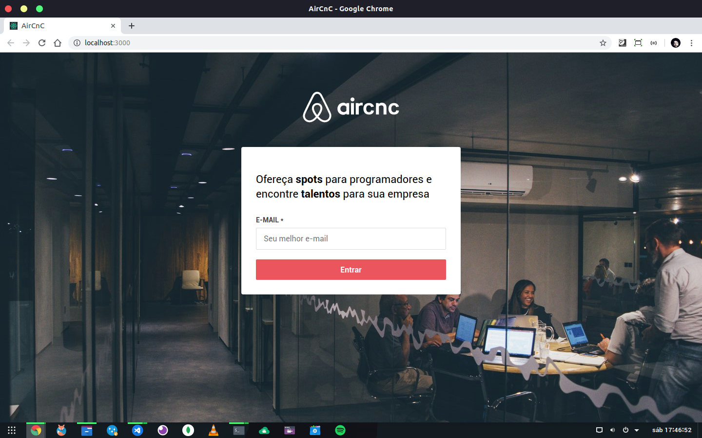
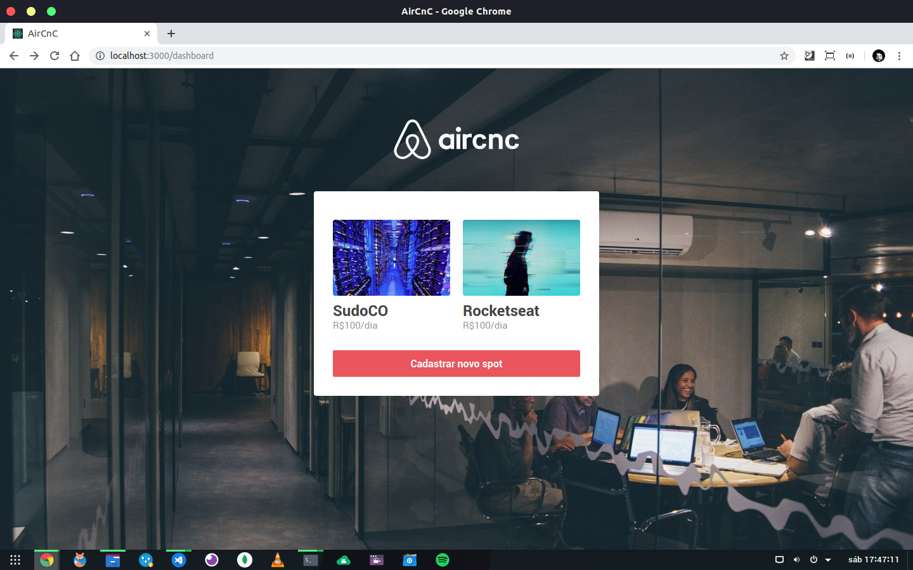
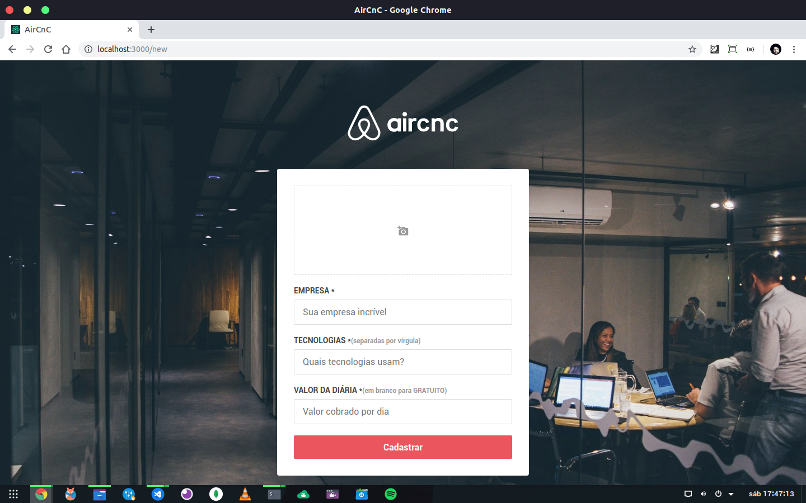
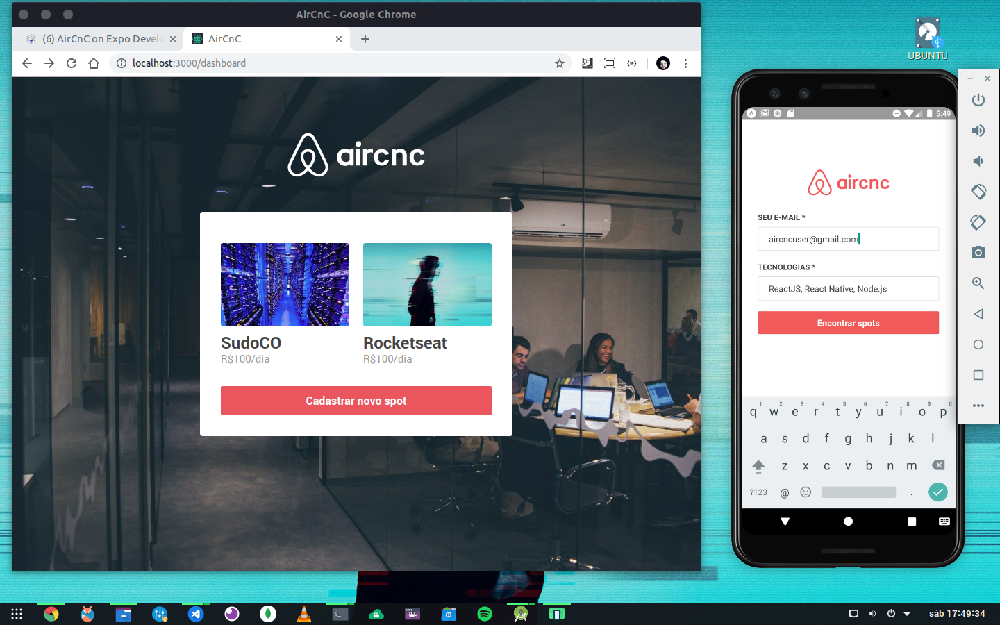
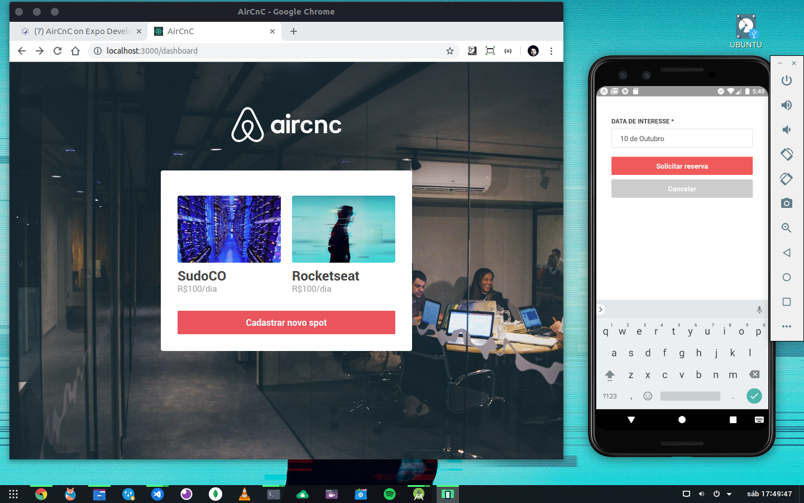
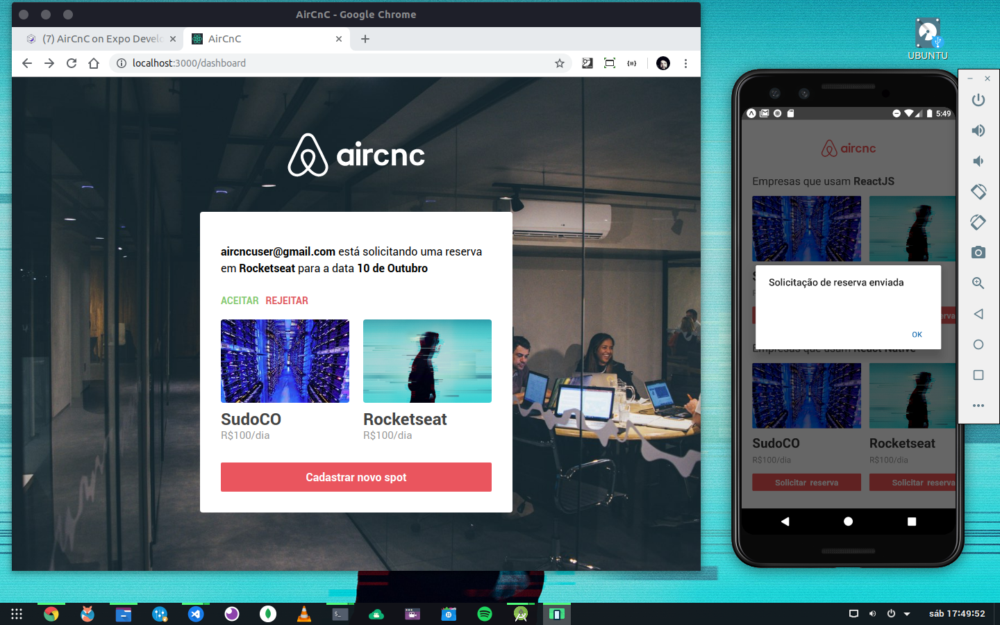
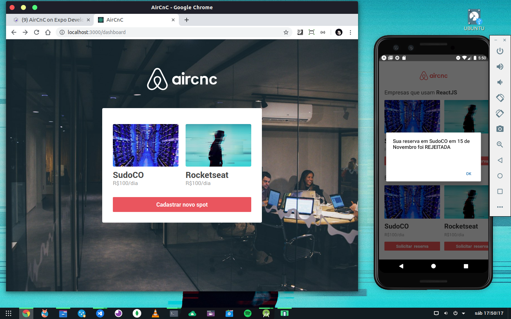

# Omnistack 9.0
Projeto aircnc (baseado no airbnb) da semana Omnistack da Rocketseat

# Tecnologias usadas: NodeJS/Backend, React/Web, React-native/Mobile e MongoDB/Banco de dados.

# 01 Aplicação Web - Área de Login.

 

# 02 Aplicação Web - Usuário Logado.

 

# 03 Aplicação Web - Área de cadastro de empresa/spot.

 

# 04 Aplicação Mobile - Área de Login.

 

# 05 Aplicação Mobile - Área de reserva com a empresa/spot.

 

# 06 Aplicação Mobile - Mensagem de envio de solicitação enviada.

 

# 07 Aplicação Mobile - Mensagem de solicitação APROVADA.

 

# 08 Aplicação Mobile - Mensagem de solicitação RECUSADA.

 

